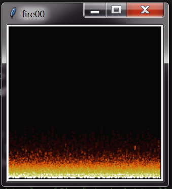
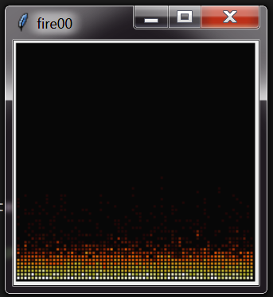
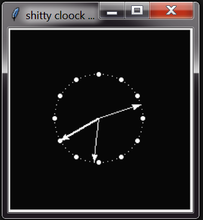
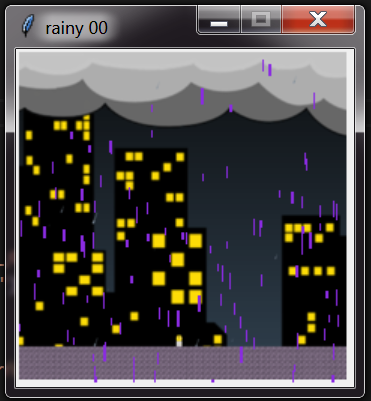
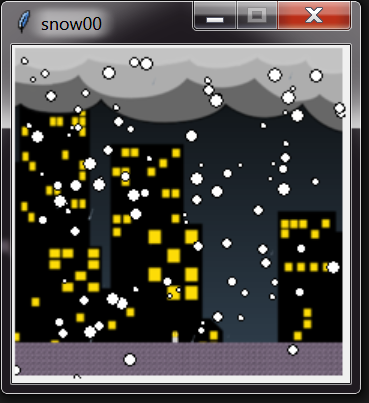

# gui

Random gui and graphics algo snippets.
Tkinter and so on.

- DOOM [fire](fir00.py) algorithm. python3, tkinter.
  
  
  
  or with little bit improvments:
  
  ```python
  #copy fire array 2 canvas
      for y in range(0, w_height, 3):
          for x in range(0, w_width, 3):
              if fire[y*w_height+x] != 0:
  ```
  
  

- junk looking [clock](clock00.py). python3, tkinter.
  
  

- rainy night. [rain](rain.py) with python3, tkinter.
  
  

- let it Snow. [snow](snow01.py) with python3, tkinter.
  
  


